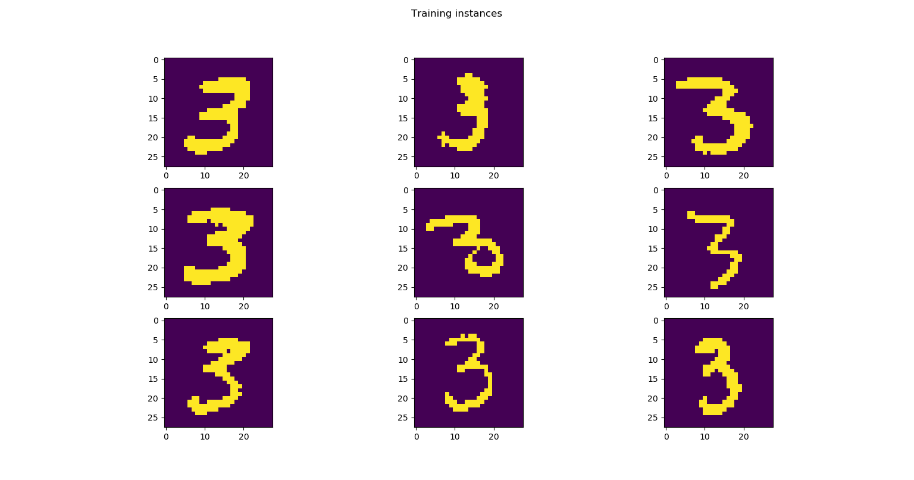
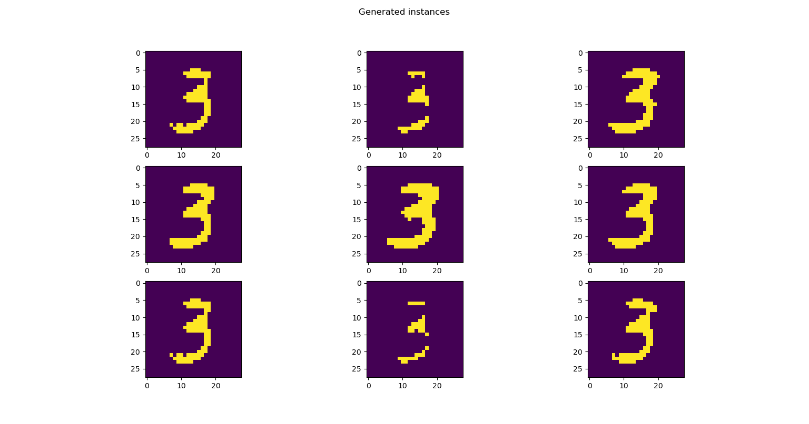

# Generative-Models
A repository containing code for implementing Deep Learning Generative Models using Python

### Restricted Boltmann Machines

The model is persent in [rbm.py](rbm.py) and its coressponding notebook in [RMBs.ipynb](RBMs.ipynb)

The usage is shown below.

Data must of the shape ``(n_samples, n_features)``. For example, the ``n_features`` of images are its number of pixels and ``n_samples`` are the number of samples present in your training dataset. If there are 60000 images of size 28x28, then the input shape will be ``(60000, 784)``. The ``fit(X, lr=0.1, epochs=10, method="contrastive_divergence", burn_in=1000, tune=2000, verbose=False)`` method is used to train the RBM on given dataset ``X``. Once trained ``encode(training_instance)`` is used to encode a training instance onto the latent space learned by the RBM. You can use ``decode()`` method to generate new random images or ``decode(encoded)`` method to deocde an already encoded image. This is not limited to images! Any type of data can be used!

The following example shows how to train the RBMs on mnist dataset.

```python
import numpy as np
import matplotlib.pyplot as plt
import rbm
from keras.datasets import mnist

(X_train, y), (_, _) = mnist.load_data()

# Normalize and reshape
X_train = X_train.reshape(60000, -1)
X_train = 1. * ((X_train[y == 3][:101] / 255.) >= 0.5)

# Plot some training isntances
fig, ax = plt.subplots(nrows=3, ncols=3, figsize=(10, 10))
ax[0, 0].imshow(X_train[0].reshape(28, 28))
ax[0, 1].imshow(X_train[1].reshape(28, 28))
ax[0, 2].imshow(X_train[2].reshape(28, 28))
ax[1, 0].imshow(X_train[3].reshape(28, 28))
ax[1, 1].imshow(X_train[4].reshape(28, 28))
ax[1, 2].imshow(X_train[5].reshape(28, 28))
ax[2, 0].imshow(X_train[6].reshape(28, 28))
ax[2, 1].imshow(X_train[7].reshape(28, 28))
ax[2, 2].imshow(X_train[8].reshape(28, 28))
fig.suptitle("Training instances")
plt.show()

# We will mainly experiment with different latent space
# dimensions. For this instance, i have a 30-D latent space.
hidden_dims = 3

# Define our model
model = rbm.BinaryRestrictedBoltzmannMachine(hidden_dims)

# Train the model on our dataset with learning rate 0.5
model.fit(X_train, lr=0.005, method="gibbs_sampling", burn_in=1000, tune=2000, epochs=20, verbose=True)

# Use the `decode()` method to generate an image.
images = [model.decode() for _ in range(9)]

fig, ax = plt.subplots(nrows=3, ncols=3, figsize=(10, 10))
ax[0, 0].imshow(images[0].reshape(28, 28))
ax[0, 1].imshow(images[1].reshape(28, 28))
ax[0, 2].imshow(images[2].reshape(28, 28))
ax[1, 0].imshow(images[3].reshape(28, 28))
ax[1, 1].imshow(images[4].reshape(28, 28))
ax[1, 2].imshow(images[5].reshape(28, 28))
ax[2, 0].imshow(images[6].reshape(28, 28))
ax[2, 1].imshow(images[7].reshape(28, 28))
ax[2, 2].imshow(images[8].reshape(28, 28))
fig.suptitle("Generated instances")
plt.show()
```

Some training instances are shown below.



This model generates the following images!


